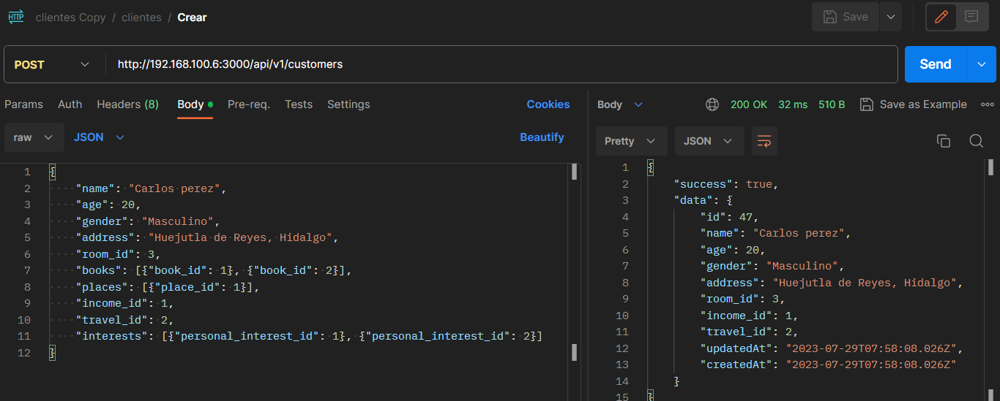
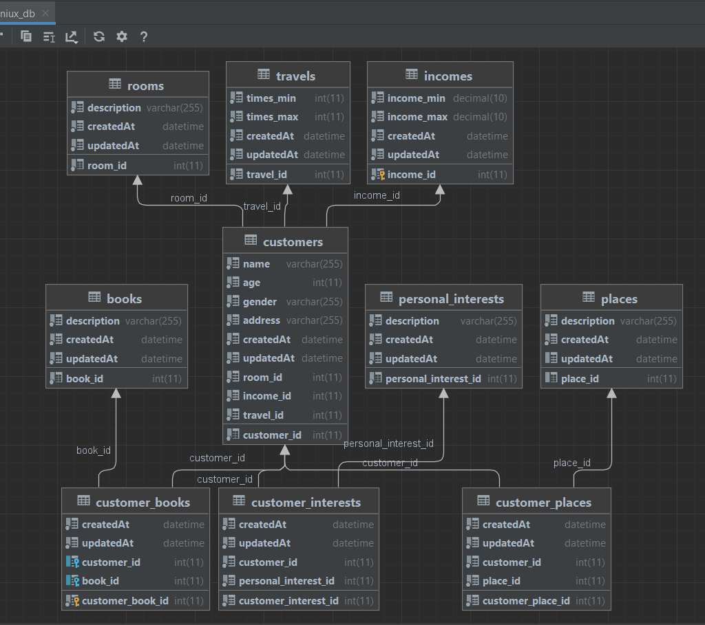

# API de NodeJs para registrar cliente

### Pasos para ejecutar el proyecto
 

* Clonar el proyecto
```
git clone https://github.com/AngelAlbertoDeLaCruzGarcia/Actores.git
```
* Instalar los paquetes
```
npm install
```
* Ejecutar el proyecto
```
npm run dev
```
* Ejecutar el Script sql.sql ubicado en la raiz del repositorio que inserta algunos registros para poder agregar al cliente

## Endpoinds Testeadas en Postman

* [Postman](https://www.postman.com/mission-participant-20938729/workspace/inxeniux/collection/22485193-f1439ef7-fc55-4f61-8ce3-9726e046cbf4?action=share&creator=22485193)

## Librerias usadas en el proyecto

* [Sequelize](https://sequelize.org/) 
* [Node](https://nodejs.org/es)
* [Express js](https://expressjs.com/)
* [Dotenv](https://www.npmjs.com/package/dotenv)
* [Axios](https://github.com/axios/axios)




## Autor

* **Angel Alberto De La Cruz Garcia** - [Linkedin](https://www.linkedin.com/in/angel-alberto-de-la-cruz-garcia-0b445621a/)


